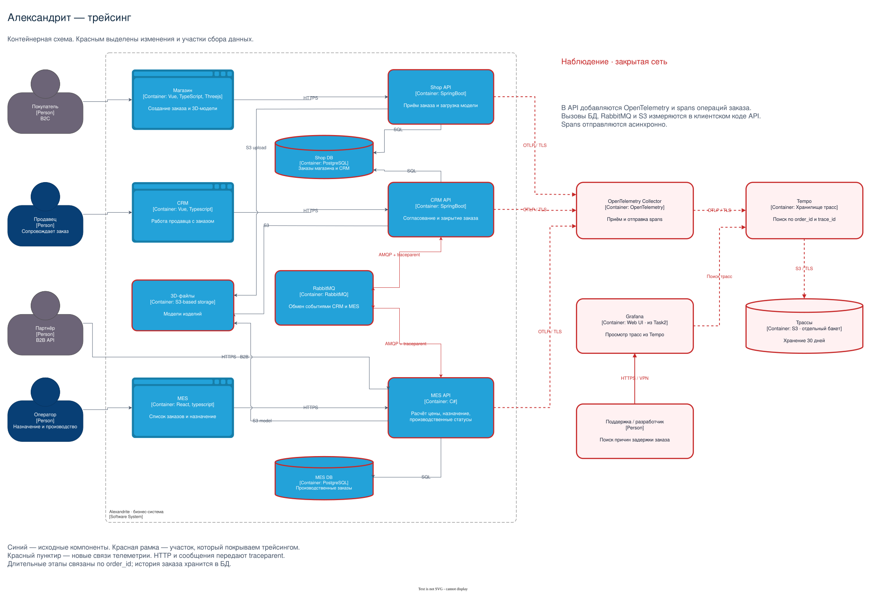

# Архитектурное решение по трейсингу

## Мотивация

По жалобе клиента сейчас трудно понять, где остановился заказ. Трейсинг связывает операции приложений и показывает время обращения к БД, хранилищу моделей и очереди. По номеру заказа поддержка сможет найти последний выполненный шаг и передать проблему нужному разработчику.

После внедрения и исправления найденных ошибок сравниваем четыре показателя: время поиска причины сбоя, время восстановления обработки заказа, долю просроченных заказов и число повторных обращений в поддержку.

## Какие участки покрыть

| Участок | Что может произойти |
| --- | --- |
| Shop API: загрузка модели и отправка заказа | Не сохранился файл в S3, не записался заказ или не завершилась передача на следующий этап. |
| MES API: приём B2B и расчёт цены | Долгое ожидание расчёта, ошибка чтения модели, зависание вычисления или записи результата. |
| MES — RabbitMQ — CRM, в обе стороны | Ошибка публикации, задержка доставки, повторная обработка или ошибка создания B2B-заказа в CRM. |
| CRM API: согласование и закрытие | Не сохранён новый статус или не отправлено событие в MES. |
| MES API: список, назначение и производственные статусы | Медленный SQL, конфликт назначения, ошибка сохранения статуса. |

Вызовы Shop DB, MES DB и S3 трассируются в коде клиентов внутри API. Устанавливать SDK в managed БД не требуется. На схеме эти зависимости тоже выделены красной рамкой. Точный механизм передачи B2C-заказа от магазина дальше нужно уточнить по коду: общая Shop DB сама по себе контекст трассы не передаёт.

## Данные трассировки

Для каждой операции сохраняем:

- `trace_id`, `span_id`, родительский span — связь операций;
- время начала, длительность, название операции, сервис и окружение;
- `order_id` и канал `b2c`/`b2b`, чтобы найти все операции заказа;
- результат, код HTTP или тип ошибки;
- старый и новый статусы для перехода заказа;
- `event_id`, очередь и номер попытки для сообщений;
- число полигонов для расчёта цены.

Полные тела запросов, SQL-параметры, содержимое моделей и персональные данные в трассы не включаем.

## Предлагаемое решение

Используем OpenTelemetry: Java agent для Shop API и CRM API, .NET SDK для MES. Автоматически собираем HTTP- и SQL-операции; вручную добавляем spans расчёта цены, смены статуса, публикации и обработки сообщений.

Контекст `traceparent` передаётся между HTTP-вызовами и в заголовках сообщений RabbitMQ. Потребитель извлекает его и создаёт span обработки. `event_id` сохраняется при повторной доставке, а попытки имеют отдельные spans. Это позволяет отличить повтор от нового события. Механизм передачи контекста описан в [OpenTelemetry](https://opentelemetry.io/docs/concepts/context-propagation/).

Не держим одну трассу открытой все три недели производства. Отдельный запрос или обработка сообщения создаёт короткую трассу, а `order_id` связывает трассы разных этапов. Текущее состояние и длительные паузы проверяем по истории статусов в БД, поскольку отсутствие span ещё не доказывает потерю заказа.

Приложения асинхронно отправляют spans в **OpenTelemetry Collector**, он передаёт их в **Tempo**. Для начала достаточно одного процесса Tempo; трассы храним 30 дней в отдельном S3-бакете, изолированном от 3D-моделей. Просмотр и поиск по `order_id` — через Grafana из задания 2. Возможность такого развёртывания и хранения описана в [документации Tempo](https://grafana.com/docs/tempo/latest/configuration/).

Сохраняем все трассы выбранных операций с заказами, исключая проверки доступности. Объём хранения проверяем после подключения первых сервисов.

[Редактируемая схема draw.io](diagrams/alexandrite-tracing.drawio). За основу взята [исходная схема](diagrams/alexandrite-source.drawio). Красным выделены доработанные участки, новые компоненты и связи. Grafana уже запланирована в задании 2; здесь добавляется источник Tempo.

## Компромиссы

Трейсинг увеличивает расход ресурсов и требует изменений в купленной MES, хотя исходники доступны. Сначала покрываем путь MES — RabbitMQ — CRM, затем магазин и остальные операции. Фронтенд на первом этапе не инструментируем: серверные трассы не объяснят задержку отрисовки в браузере.

Сбой до отправки span или потеря телеметрии оставят пробел. Трейсы старше 30 дней будут удалены, поэтому они не заменяют историю заказа. При недоступности Collector приложения продолжают работать; буфер отправки ограничен. Исправление доставки сообщений остаётся отдельной задачей из Task1.

## Безопасность

Grafana доступна сотрудникам через VPN и учётную запись с нужной ролью. Поддержка и разработчики получают просмотр, DevOps — управление настройками. У Tempo нет встроенного слоя аутентификации, поэтому его API не публикуем: сетевой доступ разрешён только Collector и Grafana. Передачу телеметрии защищаем TLS, доступ к S3 выдаём отдельной служебной учётной записи. Данные prod отделяем от dev/release, удаление выполняем по сроку хранения.
