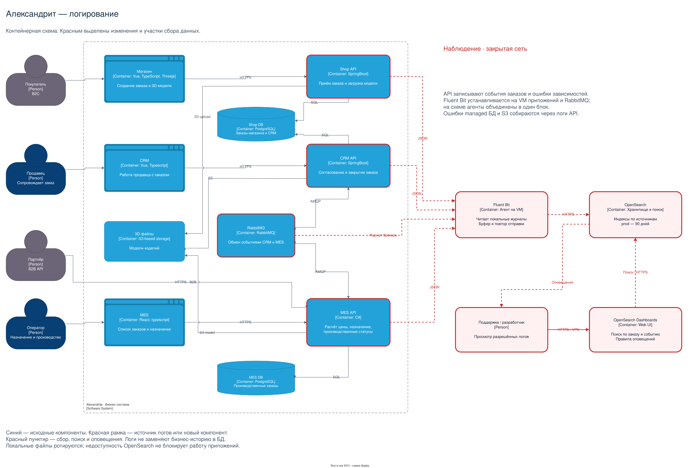

# Архитектурное решение по логированию

## Мотивация

Логи нужны для разбора конкретных ошибок: какое действие выполнялось, с каким заказом и чем закончилось. Сейчас эта информация собирается со слов клиента, поэтому поддержка и разработчики тратят много времени на воспроизведение.

После внедрения сравниваем время разбора обращения, время восстановления после сбоя, долю обращений с повторным запросом сведений у клиента и количество повторных инцидентов с одной причиной. Логи помогут быстрее находить причины; уменьшение числа сбоев зависит от последующих исправлений.

## Какие логи собирать

Общий формат — JSON. Каждая запись содержит время UTC, уровень, сервис, окружение, событие и результат. Для операций заказа добавляем `order_id`, `trace_id`, а при работе с сообщениями — `event_id`. Поля, которых нет в текущей операции, не заполняем.

| Система | События уровня INFO | Дополнительные данные |
| --- | --- | --- |
| Shop API | Создание заказа, завершение загрузки модели, отправка заказа | Внутренний ID покупателя, номер заказа, версия модели, канал. |
| MES API | Приём B2B-заказа, начало и окончание расчёта цены | ID партнёра, номер задания, число полигонов, длительность. |
| CRM API | Создание заказа из сообщения MES, согласование производства, закрытие | Номер заказа, ID сообщения, ID сотрудника или источник подтверждения доставки. |
| Все три API | Сохранённое изменение статуса | Старый и новый статусы, ID исполнителя, номер заказа. Успех записывается после фиксации в БД. |
| MES API | Назначение заказа оператору | Номер заказа, ID оператора, результат назначения. |
| CRM API и MES API | Подтверждённая публикация, успешная обработка сообщения, пропуск дубликата | ID события, очередь, номер попытки и длительность. |
| Все три API | Запуск приложения и завершение HTTP-запроса | Версия приложения; для HTTP — шаблон маршрута, код ответа и длительность. Частые успешные проверки доступности исключаем. |
| RabbitMQ | Запуск и остановка брокера, открытие и закрытие соединений | Узел и имя приложения. Действия с конкретными заказами пишутся в API, а не в журнале брокера. |

Ошибки обращения к Shop DB, MES DB и S3 также пишут API: тип операции, длительность, безопасный код ошибки. Для первого этапа этого достаточно; серверные журналы managed БД остаются доступны DevOps в облаке.

**WARN** используем для повторной попытки, конфликта назначения и медленной операции. **ERROR** — для неуспешного расчёта, недоступной зависимости или сообщения, ушедшего в очередь ошибок. **DEBUG** включаем временно на release или для конкретного компонента при расследовании; постоянно в prod он не нужен.

## Очерёдность внедрения

1. Сначала логи MES, обработчиков RabbitMQ и CRM: здесь принимается B2B-заказ и создаётся его копия в CRM. Они дадут сведения для разбора текущих жалоб. Затем добавляем сквозной трейсинг этого же пути.
2. Следом подключаем Shop API и трассировку обращений всех API к БД и S3, чтобы охватить B2C и медленный дашборд.
3. Клиентские ошибки браузеров и расширенный сбор инфраструктурных журналов оставляем на последующие итерации, если серверных данных окажется недостаточно.

Так C#-разработчик и DevOps не должны одновременно внедрять всё во всех приложениях.

## Предлагаемое решение

Приложения пишут JSON в локальные файлы с ротацией. **Fluent Bit** на виртуальных машинах читает их и журнал RabbitMQ, затем отправляет записи в **OpenSearch** по HTTPS. **OpenSearch Dashboards** используется для поиска по заказу, событию и трассе. Прямая отправка Fluent Bit в OpenSearch поддерживается его [выходным модулем](https://docs.fluentbit.io/manual/data-pipeline/outputs/opensearch).

На старте используем один кластер OpenSearch для логов всех приложений. Отдельные сервисы пересылки и обработки не нужны. Агент имеет ограниченный дисковый буфер и повторяет отправку при сбое. Недоступность OpenSearch не останавливает оформление заказов, но длительный сбой может привести к потере логов после заполнения буфера. Это требует оповещения DevOps.

[Редактируемая схема draw.io](diagrams/alexandrite-logging.drawio). Красным выделены источники, новые компоненты и связи сбора. Fluent Bit показан одним блоком, но устанавливается на каждой VM с источником логов. На managed БД агент не устанавливается.

## Безопасность

Не записываем пароли, токены, заголовки авторизации, ФИО, адреса, телефоны, тела запросов и 3D-файлы. Для поиска достаточно внутренних идентификаторов. Тексты исключений тоже очищаем: в них могут оказаться SQL-параметры или подписанные URL.

Доступ к Dashboards — по учётным записям из сети компании/VPN. Поддержка читает события заказов, разработчики — диагностические логи своих сервисов, DevOps управляет хранением. Агенту разрешена только запись в нужные индексы. OpenSearch закрыт от публичного доступа, диски зашифрованы, prod отделён от тестовых окружений.

## Хранение

Создаём отдельные ежедневные индексы по окружению и источнику: `prod-shop-*`, `prod-crm-*`, `prod-mes-*`, `prod-rabbitmq-*`. В prod храним записи 90 дней, чтобы разбирать жалобы на заказы, задержавшиеся на несколько месяцев; в dev/release — 7 дней. Удаление старых индексов автоматическое. Бизнес-история статусов остаётся в БД и не зависит от срока хранения логов.

Для начальной оценки допустим 100 000 записей в сутки по 1 КБ: около 100 МБ в день и 9 ГБ за 90 дней до индексации. С учётом индекса, одной реплики и запаса ориентир — 40 ГБ на prod. Это расчётный пример, а не измеренная нагрузка; реальный размер уточняем по первой неделе сбора.

## Анализ и оповещения

Сохраняем запросы для поиска всей истории по `order_id`, ошибок расчёта, повторов сообщений и конфликтов назначения. `trace_id` позволяет перейти к соответствующей трассе в Grafana.

В OpenSearch настраиваем оповещения о новых типах ошибок расчёта и сериях неудачных обработок сообщений. Рост 5xx и DLQ уже контролируется в задании 2, одинаковые уведомления не дублируем. Заполнение буфера агента и диска OpenSearch контролируем через мониторинг.

Для аномалий достаточно простого правила: число созданий заказов за минуту выросло в пять раз относительно обычного уровня и превысило минимальный рабочий порог. Поддержка проверяет канал и партнёра. Это повод для расследования, а не доказательство атаки; автоматическую блокировку по одному такому сигналу не включаем.
