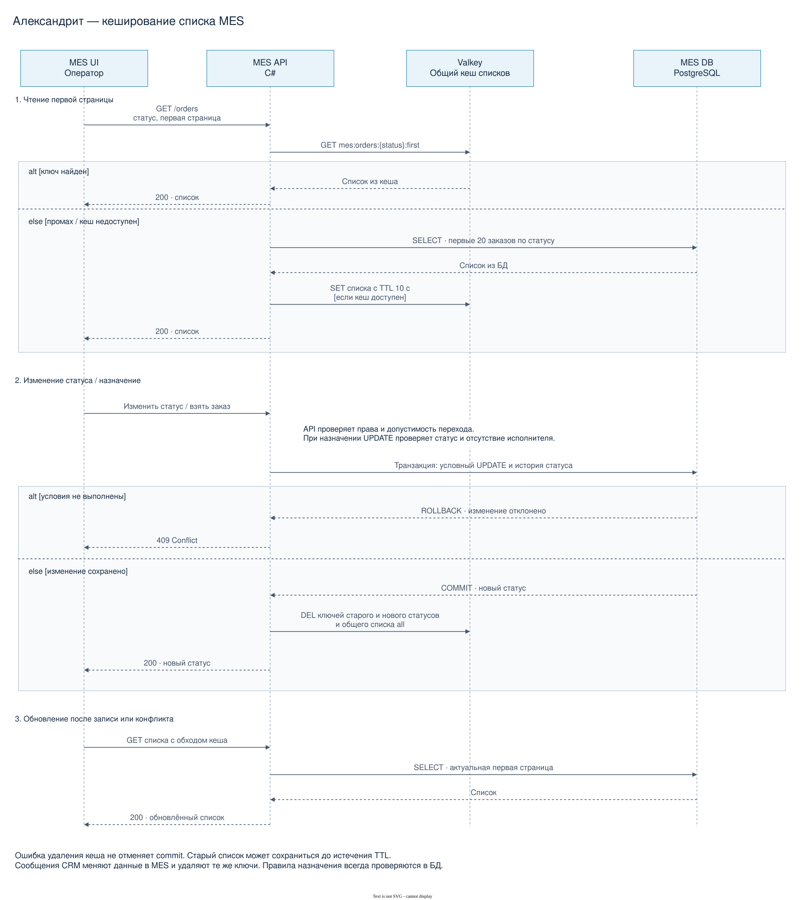

# Архитектурное решение по кешированию

## Мотивация

Операторы MES часто открывают первую страницу, чтобы увидеть новые заказы. Повторное выполнение одинакового запроса нагружает БД. Предлагаю кешировать общую первую страницу списка по статусу: это должно уменьшить время ответа и освободить ресурсы MES DB.

Перед внедрением нужно измерить запрос списка, проверить индексы и убрать лишние поля ответа. Кеш поможет, если заметная часть задержки приходится на повторное чтение из БД.

## Предлагаемое решение

Выбираю **серверный кеш в Valkey** и паттерн **Cache-Aside**. MES API проверяет кеш, а при промахе читает MES DB и сохраняет полученный список с TTL. Один кеш обслуживает всех операторов, имеющих доступ к общей очереди. Клиентский кеш не уменьшает нагрузку от других операторов и сложнее обновляется после чужих изменений.

| Паттерн | Оценка для списка заказов |
| --- | --- |
| Cache-Aside | Заполняет только востребованные списки. Прост в реализации и допускает работу через БД при отказе кеша. Выбираю его. |
| Write-Through | Потребует при каждой записи обновлять ещё и списки по затронутым статусам. Это усложнит запись, даже когда список никто не открывает. |
| Refresh-Ahead | Потребует фонового обновления востребованных списков до истечения TTL. Для небольшого кеша с коротким TTL это лишний механизм. |

Порядок чтения и обновления соответствует [описанию Cache-Aside](https://learn.microsoft.com/en-us/azure/architecture/patterns/cache-aside): сначала записываем данные в БД, затем удаляем связанные записи кеша.

### Что хранится в кеше

Кешируем первые 20 заказов для каждого статуса и вариант «все статусы». Сортировка фиксирована: `created_at DESC, id DESC`. Ключ — `mes:orders:{status}:first`, например `mes:orders:MANUFACTURING_APPROVED:first`; для общего списка используем `all`. Значение содержит только поля карточек списка: номер, дату, статус и исполнителя. TTL — 10 секунд без продления при чтении.

Другие страницы, произвольные фильтры, поиск и список «мои заказы» читаются из БД. Общий кеш применяем только там, где операторы видят одинаковые данные; проверка прав выполняется до чтения. При различающихся правах запрос идёт в БД. Dev/release/prod используют отдельные кеши.

Результаты расчёта цены и 3D-модели пока не кешируем: модели могут быть уникальными, а повторяемость расчётов неизвестна. Уже рассчитанная цена сохраняется в основной БД.

### Чтение и изменение статуса

[Редактируемая диаграмма draw.io](diagrams/mes-cache-sequence.drawio).

При чтении MES API возвращает список из Valkey. Если ключа нет, API выполняет запрос к MES DB, записывает результат в кеш на 10 секунд и отдаёт его оператору. При недоступности кеша чтение идёт из БД с обычным ограничением числа параллельных запросов.

При смене статуса сначала проверяем допустимость перехода и сохраняем изменение в БД. После успешного commit удаляем кеш старого и нового статусов, а также `all`. При назначении проверяем в одном условном UPDATE, что заказ ещё свободен и находится в `MANUFACTURING_APPROVED`. Один оператор получает успех, второй — `409 Conflict`. Кеш не участвует в решении, можно ли взять заказ.

После своей записи или конфликта интерфейс заново запрашивает первую страницу с обходом кеша и не применяет ответы от более ранних запросов. Пока страница открыта, обновляет список каждые 10 секунд и при возврате на вкладку.

### Инвалидация

Используем удаление конкретных ключей после изменения данных и короткий TTL как страховку:

- при создании заказа удаляем ключ его статуса и `all`;
- при смене статуса — ключи старого и нового статусов и `all`;
- при изменении исполнителя или других полей карточки — ключ текущего статуса и `all`.

Эти правила применяются ко всем путям изменения в MES, включая обработку сообщения CRM. Ключей мало, они известны заранее; искать их по всему кешу не нужно. Если удаление не удалось, записываем ошибку, но не отменяем уже сохранённый статус.

Только TTL оставлял бы старые списки после каждой записи. Только удаление ключей не помогло бы при сбое удаления или прямом изменении БД. Очистка всего кеша при каждом изменении давала бы лишние промахи.

У Cache-Aside остаётся гонка: чтение старого списка может завершиться и заполнить кеш уже после удаления ключа. Старые данные тогда живут ещё до 10 секунд. С учётом обновления открытой вкладки раз в 10 секунд ожидаем задержку отображения до 20 секунд плюс время запросов. Такой же запас нужен при сбое удаления ключа.

Эту задержку предлагаем как рабочее допущение и согласуем с операторами перед включением кеша в prod. Операторы должны видеть новые заказы достаточно быстро, поскольку от назначения зависит их заработок. Ручное обновление списка выполняется с обходом кеша. Возможность взять заказ всегда проверяется в БД.

### Проверка результата

На release сравниваем p95 времени ответа списка, нагрузку на БД и долю попаданий в кеш. Измеряем задержку показа нового заказа, в том числе при сбое инвалидации. Проверяем смену статуса, одновременное назначение двумя операторами и отключение Valkey. Кеш включаем в prod, если он ускоряет чтение и задержка показа укладывается в согласованный с операторами срок.
